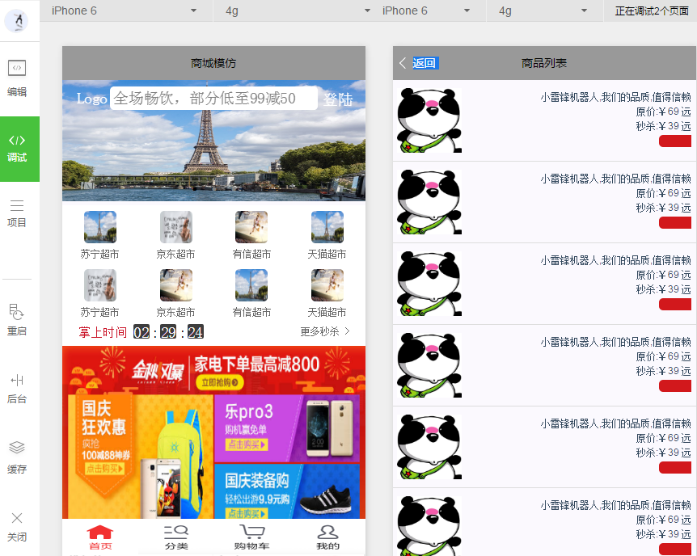

##谈一谈感受
* 刚开始写还是感觉挺刺激的...
* 写着写着发现卧槽window.innerHeight 不能用了。 window.setInterval 不能用 。。@keyframes不能用 。。bindscroll怎么不起作用...一系列小问题  
* 然后应用微信自带的组件 ，各种问题。。
## 所以问题来了重要的事情要说三遍：http://wxopen.notedown.cn/ 
* （官方文档仔细看）
* （官方文档仔细看）
* （官方文档仔细看）
*  真的真的能避免好多小问题

### 还有假如你写过vue的话，那就更方便了,写法基本一样
###  wx.request 请求  注意的一点:传输的数据一定要序列化成字符串
```javascript
    var that=this;
    wx.request({
   		 url: '/index/list',
   		 data: util.paserPostData({
    	 	num:'20'
   		 }),
   		 header:{
    	'Content-Type': 'application/x-www-form-urlencoded'
    	},
   		 method:'POST',
    	 success: function(res) {
    	 console.log(res);
       } 
    });
    }
```
###util文件里面
```javascript
	function paserPostData(obj) {
   		var arr = [];
 		 for(var p in obj){
    		if (!obj.hasOwnProperty(p)) continue;
    	arr.push(encodeURIComponent(p) + "=" + encodeURIComponent(obj[p]));
  		}
  		 return arr.join("&");

}
```
## 每个页面的title 在当前页面下的.json文件夹里加上

####   {
####    	"navigationBarTitleText": "商品列表"
####	}

## 剩下的就是wxss了 
* 强烈建议用flex布局

## 最后上图


